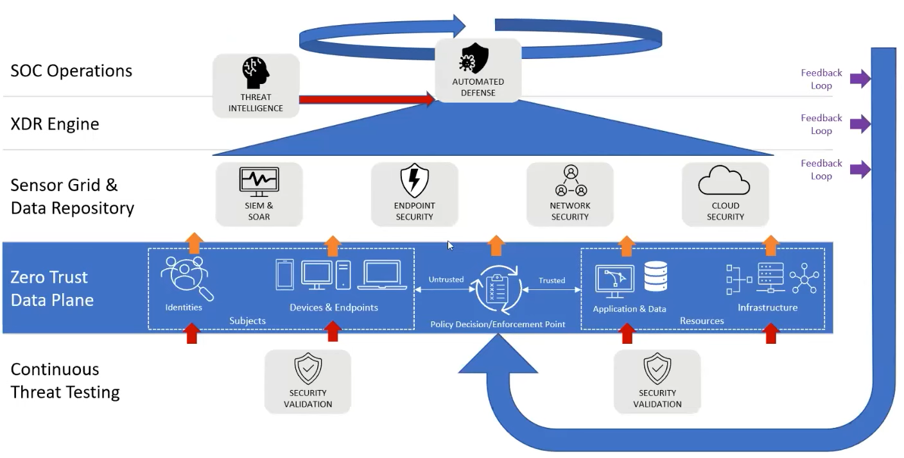
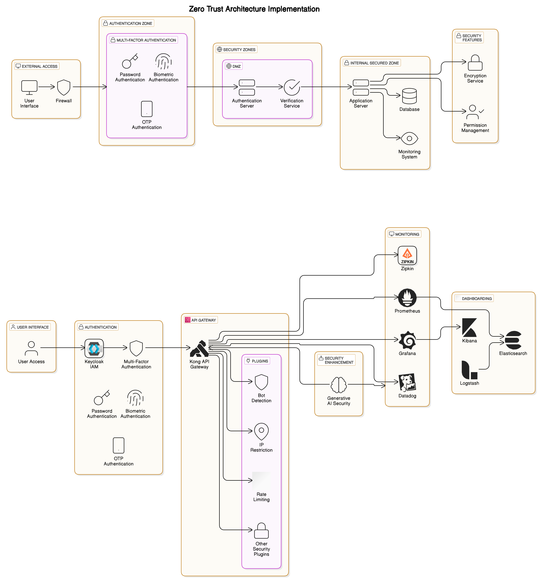
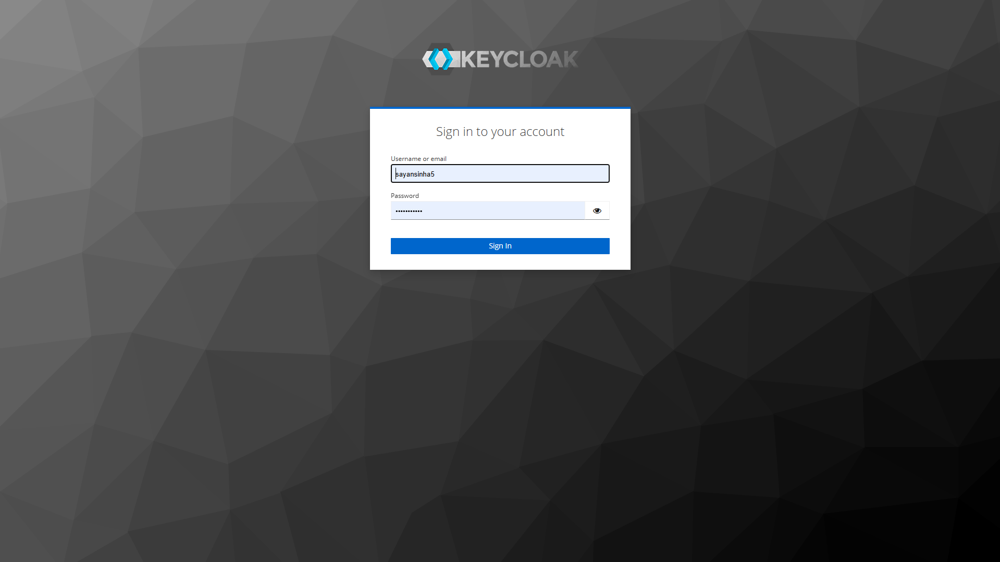
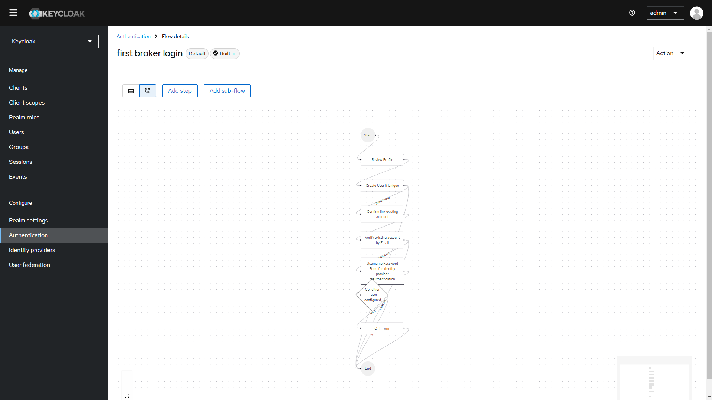
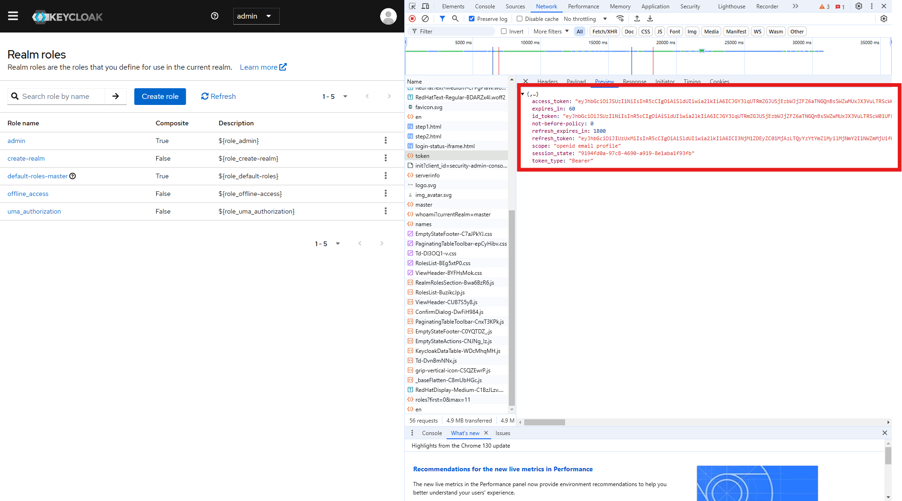
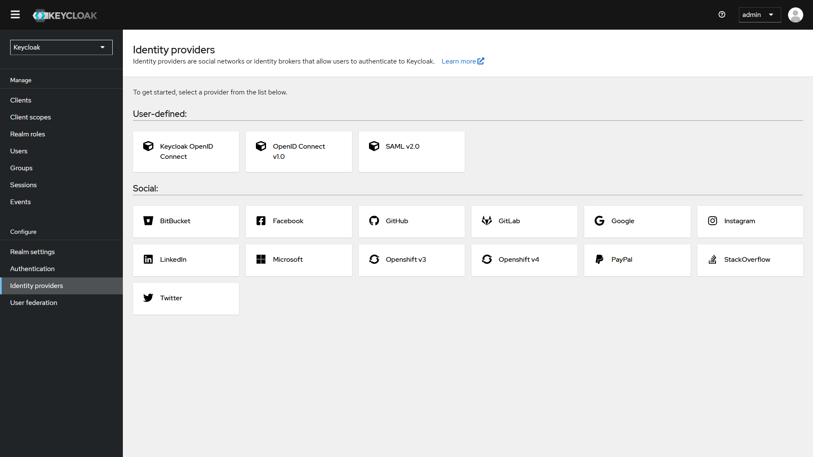
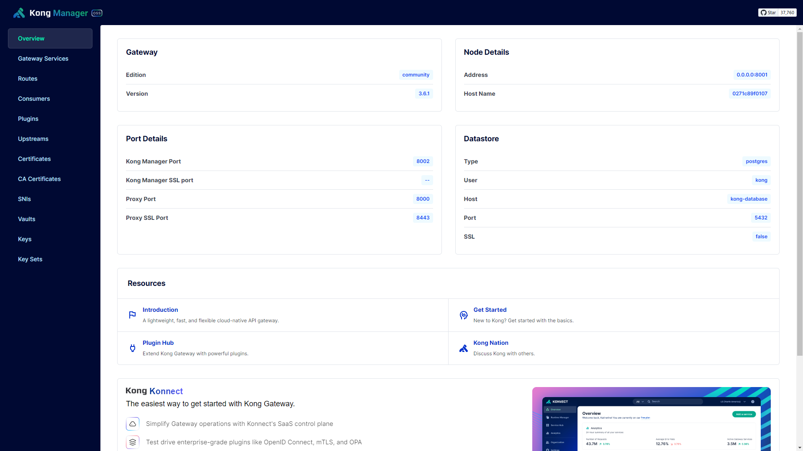
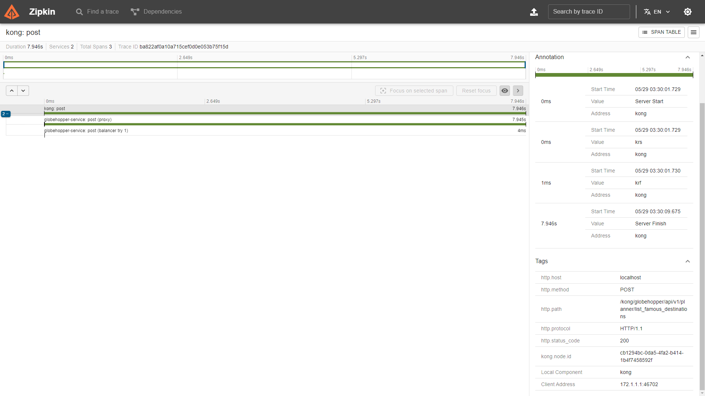
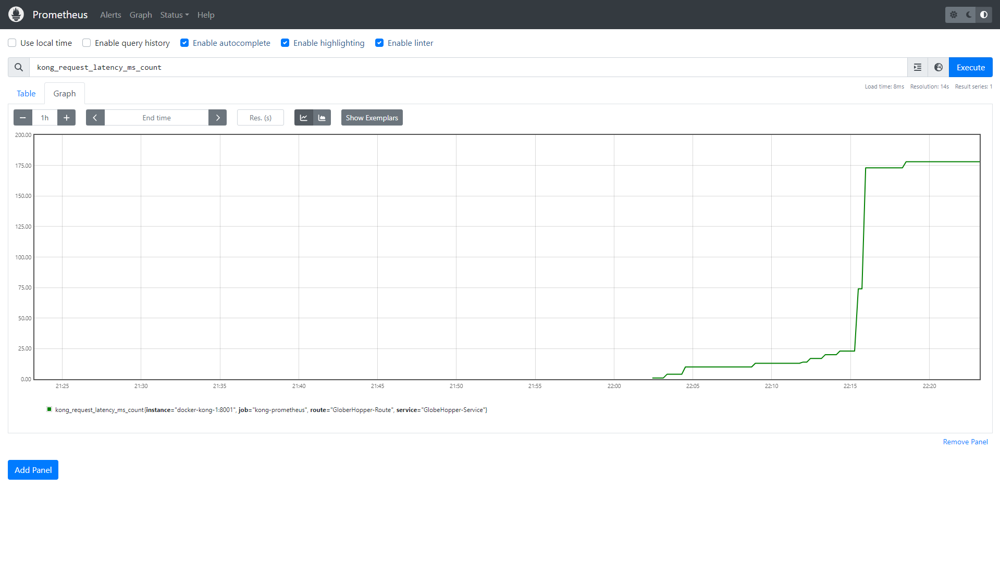
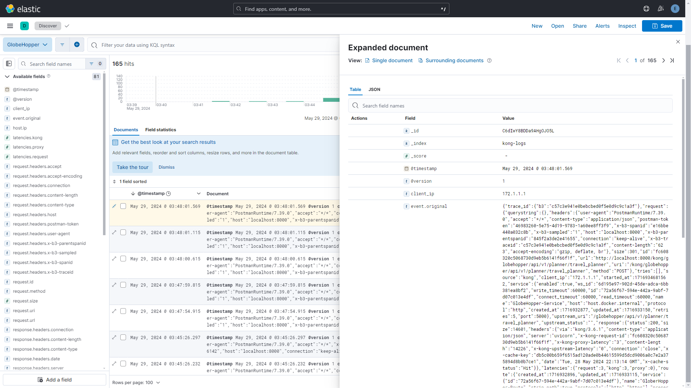

<h1 align="center">Zero Trust Architecture (ZTA)</h1>

Zero Trust Architecture (ZTA) implementation with a focus on a secure user interface, outline that emphasizes verification for every request. This includes multi-factor authentication (MFA), continuous monitoring, and robust authorization mechanisms.


<p align="center">
  
</p> 

## 1. Project Architecture

<p align="center">
  
</p> 

# Kong Docker Setup

## 1. Getting Started With The Fast API Application

```sh
$ git clone https://github.com/raj713335/Zero_Trust_Architecture_ZTA.git
$ cd Zero_Trust_Architecture_ZTA
$ pip install -r requirements.txt
$ python main.py
```

## Run & Go
For easy installation and setup run a single command below.
```docker-compose
 docker-compose up -d --build
```

----------

## 2. Keycloak for SSO

Keycloak is an open-source identity and access management (IAM) solution designed to help developers and administrators manage authentication, authorization, and user identities across applications. It simplifies and secures access to applications and services by centralizing user authentication and integrating with multiple authentication providers. Keycloak is widely used in enterprise environments for implementing single sign-on (SSO), multi-factor authentication (MFA), and other security protocols across various applications.

Key Features of Keycloak

- Single Sign-On (SSO): Users can log in once and access multiple applications without having to authenticate again, enhancing user convenience and security.

- Multi-Factor Authentication (MFA): Keycloak supports various MFA methods, such as one-time passwords (OTP) via mobile apps or email, SMS, and other custom mechanisms to improve account security.


<p align="center">
  
  
  
  
</p> 

## 3. Real-time  API monitoring </h3>

- Kong API Gateway
- Zipkin 
- Prometheus
- Grafana
- Logstash
- Elasticsearch
- Kibana

<p align="center">
  
  
  
  
  
  
</p> 

## 4. Zero Trust Architecture Implementation


This project implements a Zero Trust Architecture (ZTA) designed to secure a platform requiring multi-factor authentication (MFA) for all access requests, verified in real-time. Key components include **Keycloak** for identity and access management, **Kong API Gateway** for secure routing and policy enforcement, and a robust observability suite (Zipkin, Prometheus, Grafana, Datadog, Elasticsearch, Kibana, and Logstash) to monitor and visualize security metrics and user activities. Generative AI is used to provide security insights and recommend proactive adjustments.


### 1. Authentication and MFA with Keycloak
Keycloak serves as the central IAM system to ensure each access attempt is verified with secure authentication and MFA.

- **Login Interface**: A basic login form with username, password, and optional "Remember Me" checkbox.
- **MFA Step**:
  - **MFA Selection Prompt**: After entering credentials, users can select their preferred MFA method (e.g., OTP via app, SMS, email).
  - **Adaptive MFA Enforcement**: Trigger additional MFA layers based on risk factors (e.g., location, device, time of access).
- **Access Request Confirmation**: Users can view access reasons, login device, location, and IP for transparency.
- **User Authentication Dashboard**: Users can configure security features like adaptive authentication and session expiration alerts.

### 2. Secure Access via Kong API Gateway
Kong acts as the API gateway, securing and routing all API requests while enforcing access policies and monitoring control.

- **Access Request Overview Panel**:
  - Display real-time API access requests (resource, method, timestamp) for users, filtered by type.
  - Show access denials with troubleshooting links.
- **Role-Based Access Request Panel**: Allow users to request elevated access with justification, triggering a Keycloak approval workflow.
- **Policy Compliance Indicator**: Indicates compliance status of API requests (e.g., "Approved," "Blocked by Policy," "Elevated Access Required").
- **Real-Time Alerts for Suspicious Access**: Notify users of flagged requests with links to request higher access or report issues.

### 3. Monitoring and Observability Dashboard
For real-time and historical monitoring, this project leverages Zipkin, Prometheus, Grafana, Datadog, Elasticsearch, Kibana, and Logstash.

- **Real-Time Metrics Dashboard** (Grafana/Prometheus/Datadog): Displays API latency, error rates, authentication attempts, and MFA adoption rates.
- **Request Tracing (Zipkin)**: Visualize traces for API requests, showing latencies, service hops, and errors.
- **User Security Audit Logs (Elasticsearch/Kibana)**: Timestamped logs of user activities, access requests, and MFA attempts.
- **Behavioral Analysis and Risk Scoring (Kibana)**: Security dashboard with user risk scoring based on abnormal behavior.

### 4. Admin Control and Policy Management Interface
Administrators can manage user roles, access policies, and monitor platform security.

- **Policy Management Panel**: Interface to define access policies, adaptive MFA triggers, and approval workflows.
- **Access Control Dashboard**: Display user roles, active sessions, and policy compliance status.
- **AI-Driven Security Insights**: Real-time, AI-generated policy recommendations based on user behavior and detected threats.

### 5. Enhanced Security with AI-Driven Monitoring
AI models analyze access patterns, generate real-time alerts, and provide proactive security insights to protect against emerging threats.

- **AI-Powered Risk Prediction Dashboard**: Visualizes potential vulnerabilities based on historical and real-time data.
- **Anomaly Detection and Threat Alerting (Datadog + Generative AI)**: Detect anomalies like logins from new locations or multiple MFA failures.
- **AI-Driven Security Recommendations**: Tailored suggestions for improving security based on user patterns.

### 6. End-User Security Awareness and Notifications
Promote security awareness with real-time alerts and insights for end-users.

- **User-Specific Security Alerts**: Notify users of unusual access patterns or verification needs.
- **Security Insights Panel**: Display personalized security recommendations (e.g., “Enable biometric MFA”).
- **Push and Email Notifications**: Automated notifications for high-risk events, such as logins from new locations or MFA changes.

## Technical Integration Considerations

- **Keycloak and Kong Integration**: Kong manages API request routing and policy enforcement, while Keycloak handles MFA and role-based access. Kong passes user tokens to Keycloak for verification, with session tracking via MFA.
- **Data Aggregation and AI Pipeline**:
  - Use Logstash to process and forward logs from Kong and Keycloak to Elasticsearch.
  - Visualize access patterns in Kibana and Grafana.
  - Integrate Datadog’s anomaly detection with a generative AI backend for continuous insights.
- **Generative AI for Security Recommendations**: An AI model trained on security scenarios analyzes historical and real-time data to suggest policy improvements and detect anomalies.

This Zero Trust Architecture provides robust security by integrating Keycloak and Kong for authentication and authorization, using advanced monitoring tools for visibility, and enhancing security with AI-driven insights to defend against unauthorized access.
